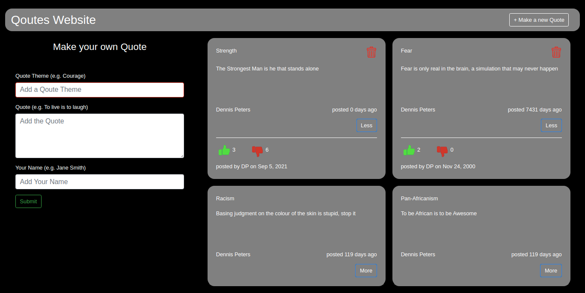

# Project Name: Quotes

### Project Description
This is an Angular Project designed to provide a platform for users to create Quotes and then having those quotes rated by other users on whether they are inspirational or not.

### Setup Instructions
The operations of the project are fairly straighforward. 
The application ia an Angular project and makes use of bootstrap as well as a custom CSS file.
Google Chrome is highly recommend to run the program.

* This website requires that you have data access to internet data.

# BDD

## Input

* Quote Theme
* Quote
* Quote Author

Behaviour User inputs the above inputs,clicks the add quote button and a new quote is created. If the user does not enter input and clicks button Add Quote,the user is prompted to input missing fields. When the user enters items in a field and then clears the field, an alert message is shown.

## Output

* New quote displayed by a card
* Upvote and Downvote

Button Clicks

* Thumbs-up icon
* Thumbs-down icon
* Behaviour

User clicks on the thumbs up button to upvote and on the thumbs down button to downvote. The displayed quotes will be arranged from the highest voted quote to the least voted quote.The highest upvoted quote is then highleted and displayed as the most upvoted quote.

* Most upvoted quote is highlighted
* Quotes are arranged from highest upvoted to least upvoted.

# Contact Infomation:
### Author: [DENNIS NJENGA](https://github.com/deepeters)

         Email: dennis@dennis.com
         Phone: +254712345678

### Technology Used
1. AngularJS
2. HTML
3. CSS
4. Javascript

### Frameworks Used
1. Git
2. Bootstrap
3. jQuery

### LICENSE: [MIT LICENSE](https://raw.githubusercontent.com/deepeters/Quotes/master/LICENSE)
